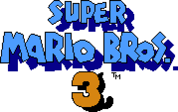
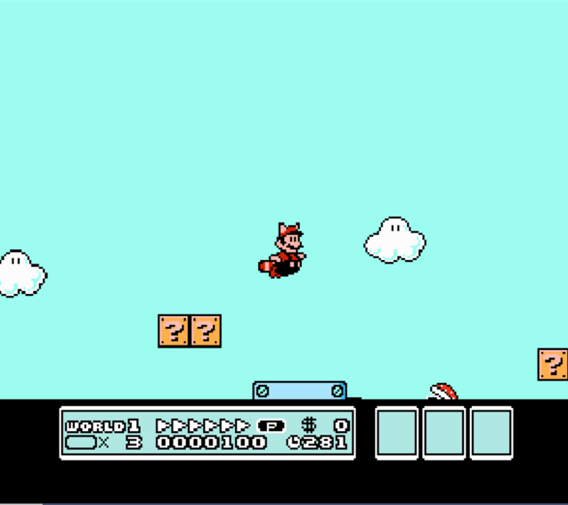

<h1 align="center">
  
</h1>

<h4 align="center">An attempt to recreate the gameplay of the classic Super Mario Bros 3</h4>

<p align="center">
    
    
    
</p>

<p align="center">
  <a href="#key-features">Key Features</a> •
  <a href="#how-to-use">How To Use</a> •
  <a href="#credits">Credits</a> •
  <a href="#author">Author</a> •
</p>

<h1 align="center">
  
</h1>

## Key Features
* Intro Scene
* World 1 Map
* World 1-1 Scene with features of the original game:
  * Mario forms: Small, Default, Raccoon, Fire, Hammer
  * Mario mechanisms: Running, Flying, Jumping on enemies, Taking items, Attacking with fire/hammer/tail, Holding and kicking Koopa shell
  * All of World 1-1's enemies
  * All of World 1-1's items and blocks
  * Special effects when Mario levels up, takes damage, and attacks
  * Pipes travelling and Bonus room


## How To Use

To clone and run this application, you'll need [Git](https://git-scm.com) and [Visual Studio](https://visualstudio.microsoft.com/downloads/) installed on your computer. From your command line:

```bash
# Clone this repository
$ git clone https://github.com/Doan-Pham/SuperMarioBros3
```
Then open SuperMarioBros3.sln at the root directory, click Start (F5) to run the program.

## Credits
Under the guidance of my lecturer, [Mr. Đinh Nguyễn Anh Dũng](https://github.com/dungdna2000), this project was made using the following frameworks, tools, and resources:
- DirectX Game Development Framework: [gamedev-intro-tutorials](https://github.com/dungdna2000/gamedev-intro-tutorials) (Provided by [Mr. Dũng](https://github.com/dungdna2000))
- Programming Language: C++
- Sprites and Textures: [MarioMayhem](https://www.mariomayhem.com/downloads/sprites/super_mario_bros_3_sprites.php), [Spriters Resource](https://www.spriters-resource.com/nes/supermariobros3/sheet/81122/), [NesMaps](https://nesmaps.com/maps/SuperMarioBrothers3/sprites/SuperMarioBrothers3Sprites.html), [mariouniverse.com](http://www.mariouniverse.com/sprites-nes-smb3/)
- Game Mechanics Info: [MarioWiki](https://www.mariowiki.com/Super_Mario_Bros._3), [StrategyWiki](https://strategywiki.org/wiki/Super_Mario_Bros._3/Enemies)
- Game Emulator for Mechanics Research: [Mesen](https://www.mesen.ca/)
- Tile and Map Creation: [Tiled](https://www.mapeditor.org/)
- Texture Extract: [ShoeBox](https://renderhjs.net/shoebox/) 
- Sprites Coordinate Extract: [SpriteCow](http://www.spritecow.com/), [TexturePacker GUI](https://www.codeandweb.com/texturepacker/documentation/user-interface-overview)
- Image Editor: [Gimp](https://www.gimp.org/)

## Author
  [**Pham Truong Hai Doan**](https://github.com/Doan-Pham)
  
